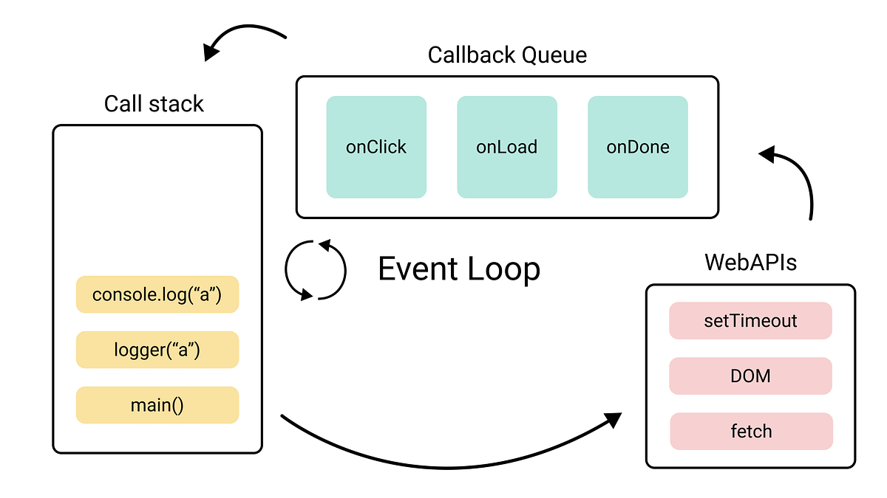

# JavaScript Callbacks
### Why doesn't JavaScript wait?

---

## Agenda

<div style="display: grid; grid-template-columns: 1fr 1fr; gap: 0 2em;">
<div>

1. Opening problem
2. Prior knowledge check
3. Functions as values
4. What is a callback?
5. The event loop
6. Error-first callbacks

</div>
<div>

7. Callback hell
8. Exercise 1 — Write Your First Callback
9. Exercise 2 — Predict the Output
10. Exercise 3 — Fix the Sequence
11. Reflection

</div>
</div>

---

## What's wrong with this code?

```javascript
console.log("Fetching user...");

setTimeout(() => {
  const user = { name: "Fatima", role: "admin" };
}, 1000);

console.log("Welcome, " + user.name); // 💥 ReferenceError
```

*Discuss with a neighbour: why does this crash?*

---

## Quick check — hands up

1. Can you pass a function as an argument to another function?

2. What does `setTimeout` do?

3. True or false: JavaScript always runs code top-to-bottom, one line at a time.

---

## Functions are values

```javascript
function greet(name) {
  console.log("Hello, " + name);
}

function runTwice(fn, value) {
  fn(value);
  fn(value);
}

runTwice(greet, "Lars");
// Hello, Lars
// Hello, Lars
```

> Note: `greet` — not `greet()`. We pass the function, not the result.

---

## What is a callback?

> A function you pass to another function, to be called **later** — usually when something has finished.

```javascript
function loadScript(src, callback) {
  let script = document.createElement("script");
  script.src = src;
  script.onload = () => callback(script);
  document.head.append(script);
}

loadScript("app.js", function(script) {
  console.log(script.src + " loaded!");
});
```

*"When you're done — call this."*

---

## The event loop



---

## Trace this

```javascript
console.log("start");

setTimeout(function() {
  console.log("timeout");
}, 0);

console.log("end");
```

Output:

```
start
end
timeout
```

*Even `0ms` waits for the call stack to be empty.*

---

## Error-first callbacks

```javascript
function loadPlaylist(name, callback) {
  if (available[name]) {
    callback(null, available[name]);   // ✅ success
  } else {
    callback(new Error("Not found"), null); // ❌ error
  }
}

loadPlaylist("chill", function(err, songs) {
  if (err) { console.error(err.message); return; }
  console.log("Playing:", songs);
});
```

> Convention: **first argument = error** (or `null`), second = result.

---

## Callback hell

```javascript
setTimeout(() => {
  console.log("Track 1");
  setTimeout(() => {
    console.log("Track 2");
    setTimeout(() => {
      console.log("Track 3");
    }, 500);
  }, 500);
}, 500);
```

Also called: **Pyramid of Doom**

Problems: hard to read, hard to handle errors, hard to change.

---

## Get the exercises

Open the GitHub Classroom assignment and accept it to get your own copy of the exercise files.

[classroom.github.com/a/nDB06XaC](https://classroom.github.com/a/nDB06XaC)

---

## Exercise 1 — Write Your First Callback

Complete `playSong` so that it:

1. Accepts a song title and a callback
2. Logs `"Playing: <title>"`
3. Calls the callback with the title when done

```javascript
function playSong(title, onFinished) {
  // your code here
}

// Call playSong here
```

Open `exercises/exercise-1.js` — *5 minutes*

---

## Exercise 2 — Predict the Output

Before running: write down what you think the output order will be.

```javascript
console.log("Opening app...");

setTimeout(function () {
  console.log("Playlist loaded");
}, 0);

console.log("Waiting for your playlist...");
```

Answer in a comment: why does `"Playlist loaded"` appear last?

Open `exercises/exercise-2.js` — *5 minutes*

---

## Exercise 3 — Fix the Sequence

A DJ set needs three songs to play in order.

Open `exercises/exercise-3.js`.

The code is broken — the songs play in the wrong order.

Fix it using callbacks so the order is always:
**Bohemian Rhapsody → Blue (Da Ba Dee) → Sandstorm**

*You have 10 minutes.*

---

## Reflection

Take 3 minutes to write your answers:

1. Before today, what did you think happened when JavaScript hit a `setTimeout`? How has that changed?

2. Describe callback hell in your own words — not as a code pattern, but as a problem.

3. Where in your own experience have you encountered something that behaves asynchronously — even outside of code?

---

## Where to next?

Callbacks are the foundation — but they have limits.

Next up: **Promises** and **async/await** — built on top of everything you learned today.

> "You've seen the problem. Now you're ready for the solution."
